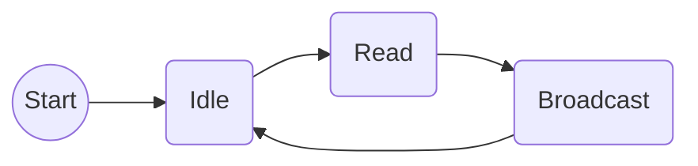

# SMQG Station
## Requirements
Functional requirements:

- FR.01 The system must read data from external sensors. 
- FR.02 The system must broadcast the data collected from sensors through a LoRa module.
- FR.03 The system must broadcast the data collected from sensors through a BLE module.

Non-functional requirements:

- NFR.01 The system must be compatible with DHT11 sensor.

## Flow chart

- Idle: Stage when the system is waiting with all the external devices shutdow, until the timeout to start the reading cicle.
- Read: The system reads all sensors and buffers the data in JSON format.
- Broadcast: The system broadcast all the buffered data through LoRa and BLE module.

## Libraries

|Functionality   |Library                        |Tutorial                     |
|----------------|-------------------------------|-----------------------------|
|DHT11 reading   |Adahfruit                      |https://randomnerdtutorials.com/esp32-dht11-dht22-temperature-humidity-sensor-arduino-ide/ |
|BLE broadcasting     |XXXX | XXXX |
|LoRa broadcasting    |XXXX | XXXX |
